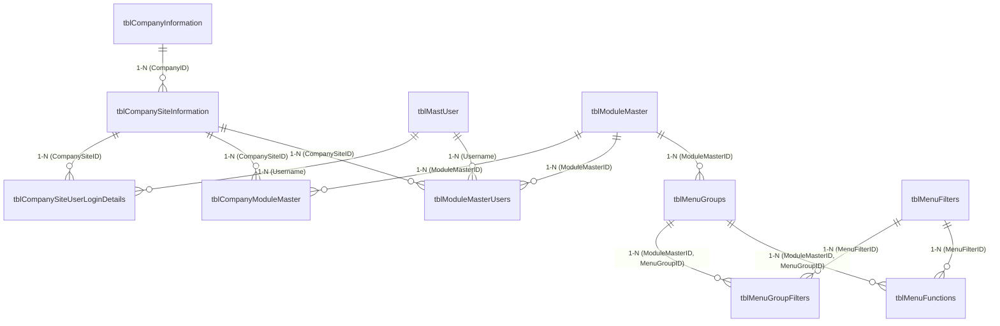

# LNTBOOST System Architecture & Implementation Memory

Tài liệu này tóm tắt toàn bộ cấu trúc thư mục, thiết kế cơ sở dữ liệu, kiến trúc lập trình và các luồng vận hành cốt lõi của cả hệ thống **Backend (ASP.NET Core Web API)** và **Frontend (React/Vite)** của dự án **LNTBOOST EMS**.

---

## 1. Bản Đồ Thư Mục Dự Án (Directory Layout)

Dự án được phân chia thành hai thư mục độc lập ở thư mục gốc:

```
LNTBOOST/
├── Backend_ASP_NET_CORE_WEB_API/   # Dự án Backend ASP.NET Core 
└── frontend/                       # Dự án Frontend React / Vite
```

### 1.1. Cấu trúc Backend
*   `LNTBOOST_EMS.csproj`: Định nghĩa target framework (`net10.0`/`net9.0`/`net8.0`) và các NuGet packages (`Dapper`, `Scalar.AspNetCore`, `Microsoft.AspNetCore.Authentication.JwtBearer`, `Microsoft.Data.SqlClient`).
*   `Program.cs`: File chạy chính. Cấu hình JWT, OpenAPI/Scalar, CORS, Dependency Injection, Middleware Authentication/Authorization.
*   `appsettings.json`: Lưu trữ ConnectionString kết nối database SQL Server (`localhost\SQLExpress`), cấu hình khóa bí mật JWT Key, Issuer và Audience.
*   `Controllers/`:
    *   `AuthController.cs`: Tiếp nhận request đăng nhập `/api/auth/login`.
    *   `SqlGatewayController.cs`: Gateway thực thi truy vấn SQL động từ client thông qua Dapper (sử dụng cho việc tải dữ liệu cấu trúc menu, chi nhánh).
*   `Services/`:
    *   `Interfaces/IAuthService.cs` & `Implements/AuthService.cs`: Chứa logic nghiệp vụ đăng nhập, so khớp mật khẩu băm BCrypt, truy vấn quyền hạn và sinh JWT Token.
*   `Models/` & `DataConfig/FluentApi/`: Chứa các thực thể và cấu hình map cơ sở dữ liệu gốc (12 bảng nghiệp vụ phân quyền).

### 1.2. Cấu trúc Frontend
*   `src/main.tsx` & `src/App.tsx`: Điểm khởi chạy và quản lý State toàn cục của ứng dụng (Trạng thái đăng nhập, Chi nhánh đang chọn, Phân hệ đang hoạt động, Nhóm menu đang làm việc).
*   `src/types/index.ts`: Định nghĩa toàn bộ kiểu dữ liệu TypeScript (User, Site, Module, MenuGroup, MenuFunction, MenuFilter...).
*   `src/services/api.ts`: API Service trung gian kết nối HTTP tới Backend.
*   `src/features/auth/`:
    *   `LoginScreen.tsx` & `.css`: Màn hình Đăng nhập (chia đôi: một bên là form, một bên là background quảng bá).
    *   `SiteSelectionScreen.tsx` & `.css`: Màn hình Chọn Chi nhánh & Phân hệ làm việc (đã tái cấu trúc thành dạng tối giản, cân giữa, hiển thị 5 module hàng ngang, click vào module sẽ vào thẳng Dashboard).
*   `src/components/`:
    *   `MenuPortalModal.tsx` & `.css`: Modal "Sơ đồ Chức năng" (đã chuyển sang nền sáng, hiển thị các Menu Group nằm ngang làm cột, các Function xếp dọc bên dưới theo phân loại).
*   `src/layouts/`:
    *   `Header.tsx` & `.css`: Thanh đầu trang (Logo, tên chi nhánh/phân hệ đang chọn, nút mở Sơ đồ Chức năng, User profile pill và nút đăng xuất).
    *   `Sidebar.tsx` & `.css`: Thanh điều hướng trái (Chỉ hiển thị duy nhất 1 nhóm menu hoạt động tại một thời điểm, các nút phân loại FILTER ở chân trang hiển thị động theo nhóm).

---

## 2. Kiến Trúc Cơ Sở Dữ Liệu & Phân Quyền (Database & Authorization Schema)

Mô hình phân quyền của LNTBOOST được tổ chức phân cấp chặt chẽ theo cấu trúc: 
**User -> Sites (Chi nhánh) -> Modules (Phân hệ) -> Menu Groups (Nhóm menu) -> Menu Functions (Chức năng con)**.



*   **`tblMastUser`**: Chứa thông tin tài khoản và mật khẩu đã băm (BCrypt).
*   **`tblCompanySiteUserLoginDetails`**: Xác định những Chi nhánh (Site) nào User được phép đăng nhập.
*   **`tblCompanyModuleMaster`**: Xác định Chi nhánh (Site) nào được phép kích hoạt những Phân hệ (Module) nào.
*   **`tblModuleMasterUsers`**: Bảng phân quyền chi tiết, quyết định **User** cụ thể tại **Site** đó được truy cập vào những **Module** nào.

---

## 3. Luồng Vận Hành Hệ Thống (Core Mechanisms & Flows)

### 3.1. Luồng Đăng nhập & Chọn Chi Nhánh (Login & Site Selection)
1.  **Xác thực tài khoản**: Người dùng nhập thông tin tại `LoginScreen`. API `POST /api/auth/login` kiểm tra tài khoản, băm mật khẩu, truy vấn danh sách Site từ `tblCompanySiteUserLoginDetails` và danh sách Module được phân quyền từ `tblModuleMasterUsers`.
2.  **Trả về JWT Token**: Token được sinh ra chứa thông tin định danh Claims của User. Frontend lưu trữ Token, danh sách Site và Module khả dụng vào `localStorage`.
3.  **Màn hình chọn Site (`SiteSelectionScreen`)**:
    *   Hiển thị dropdown chọn Site được phân quyền.
    *   Hệ thống tự động lọc danh sách Phân hệ hoạt động của Site đó (`enabledModules`).
    *   Hiển thị 5 phân hệ tiêu chuẩn hàng ngang (SCM, MANUFACTURING, FINANCE, HR, WMS). Các phân hệ được cấp quyền sẽ sáng lên (`active-highlight`) và có thể click. Các phân hệ không có quyền sẽ bị mờ đi (`disabled-module`).
    *   Người dùng click vào phân hệ sáng sẽ kích hoạt sự kiện `onConfirmSite` và được chuyển tiếp trực tiếp vào màn hình làm việc chính (Dashboard).

### 3.2. Luồng Sidebar Trái & Menu Chức Năng (Sidebar Navigation)
1.  **Thiết kế Sidebar tối giản (Focused Single-Group View)**:
    *   Sidebar được khóa lại để **chỉ hiển thị duy nhất danh sách function của 1 Menu Group**. Nút quay lại "Tất cả nhóm" và các cơ chế accordion mở rộng nhiều nhóm đã bị loại bỏ.
    *   Khi mới đăng nhập hoặc vừa đổi phân hệ, Sidebar sẽ tự động hiển thị nhóm menu đầu tiên của phân hệ đó.
2.  **Bộ lọc phân loại động (Dynamic Menu Filter)**:
    *   Các nút phân loại bộ lọc ở chân trang Sidebar (FILTER: Giao dịch, Báo cáo, Thiết lập...) được lọc động dựa trên chính các chức năng hiện có của **Nhóm Menu đang hoạt động**.
    *   Số lượng badge (badge count) bên cạnh tên bộ lọc hiển thị chính xác số chức năng thuộc bộ lọc đó nằm trong phạm vi nhóm hiện tại.
3.  **Sơ đồ chức năng (Menu Portal Modal)**:
    *   Khi người dùng cần đổi nhóm menu, họ nhấn nút "Sơ đồ chức năng" trên Header để mở modal nền sáng (`MenuPortalModal`).
    *   Modal hiển thị tất cả các Menu Group thuộc phân hệ hiện tại dưới dạng các cột xếp hàng ngang (`flex-row`). Các chức năng của mỗi nhóm được xếp dọc ở dưới theo từng danh mục phân loại.
    *   Người dùng có thể click trực tiếp vào **Tiêu đề cột (Group Header)** hoặc **Từng chức năng (Function Link)** trong modal. Modal sẽ tự động đóng, đồng thời Sidebar bên trái sẽ lập tức cập nhật để hiển thị danh sách chức năng của nhóm tương ứng.
