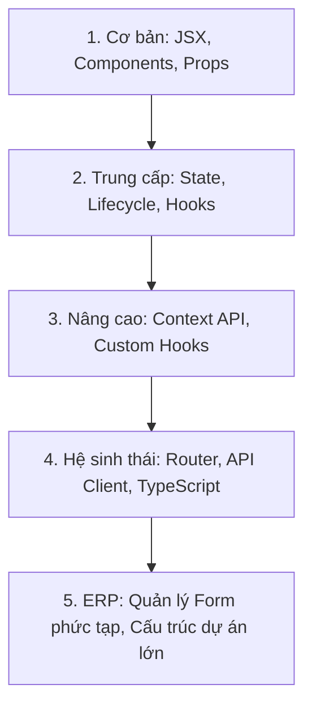

# Lộ Trình Học React ERP & Kiến Trúc Tổ Chức File/Folder Từ A-Z

Tài liệu này cung cấp cho bạn một cái nhìn toàn diện để **thành thạo React** và **làm chủ kiến trúc dự án ERP** hiện tại của bạn. Chúng ta sẽ phân tích từ lý thuyết cốt lõi đến cấu trúc tổ chức file tối ưu giúp bạn kiểm soát 100% mã nguồn.

---

## 1. Lộ Trình Học React Từ Cơ Bản Đến Nâng Cao (React Roadmap)

Để tự tin viết và sửa bất kỳ tính năng nào, bạn cần đi qua các nấc thang kiến thức sau:



### 📶 Cấp độ 1: Cơ bản (React Basics)
*   **JSX / TSX**: Cách viết giao diện kết hợp giữa HTML và JavaScript. Bạn cần hiểu:
    *   Thuộc tính `className` (thay vì `class`).
    *   Cách dùng dấu `{}` để hiển thị biến hoặc chạy code Javascript trong giao diện.
    *   *Nguồn tự học*: [React Learn - Writing Markup with JSX](https://react.dev/learn/writing-markup-with-jsx)
*   **Component & Props**: Cách chia nhỏ giao diện thành các phần độc lập (ví dụ: chia màn hình Vendor thành các Tab con, mỗi Tab là một Component). Props giúp truyền dữ liệu từ cha xuống con.
    *   *Nguồn tự học*: [React Learn - Passing Props to a Component](https://react.dev/learn/passing-props-to-a-component)

### 📶 Cấp độ 2: Trung cấp (React Hooks & State)
*   **useState (State Management)**: Bộ nhớ trong của component. Thay đổi state sẽ làm React vẽ lại giao diện (re-render).
*   **useEffect (Side Effects)**: Quản lý vòng đời component. Dùng để tự động fetch API khi màn hình xuất hiện hoặc dọn dẹp bộ nhớ (cleanup).
    *   *Nguồn tự học*: [React Learn - Synchronizing with Effects](https://react.dev/learn/synchronizing-with-effects)
*   **Làm việc với Array & Object trong State**: Trong React, **State là bất biến (immutable)**. Bạn không thể viết `state.name = "ABC"`, bạn phải viết `setState({ ...state, name: "ABC" })` bằng toán tử spread `...`. Đây là lỗi rất phổ biến khiến giao diện không cập nhật dữ liệu.
    *   *Từ khóa*: `React updating objects in state`, `React updating arrays in state`.

### 📶 Cấp độ 3: Nâng cao (Performance & Global State)
*   **Context API**: Dùng để truyền dữ liệu xuyên qua nhiều cấp component mà không cần truyền Props bắc cầu qua từng cấp. Phù hợp để lưu thông tin User Đăng nhập, Ngôn ngữ, hoặc Theme.
*   **Custom Hooks**: Tự viết ra các Hook riêng (ví dụ: `useAuth()`, `useFetch()`) để tái sử dụng logic xử lý dữ liệu giữa các màn hình khác nhau.
*   **React.lazy & Suspense (Code-Splitting)**: Tách nhỏ mã nguồn thành nhiều file riêng biệt để tải trang nhanh hơn. Chỉ khi người dùng bấm vào phân hệ SCM thì trình duyệt mới tải code của module SCM về (giúp giảm dung lượng tải lần đầu).

### 📶 Cấp độ 4: Tích hợp Hệ sinh thái & TypeScript
*   **React Router DOM**: Quản lý định tuyến trang (Routes, Outlet, Link, useNavigate).
*   **TypeScript trong React**: Định nghĩa các kiểu dữ liệu (`interface`) cho Props, State, và dữ liệu API để tránh viết sai tên thuộc tính (như gõ nhầm `vendorID` thành `vendorId`).

---

## 2. Đối Chiếu Kiến Thức Với Dự Án Hiện Tại Của Bạn

Dự án `frontend_LNT_BOOST` hiện tại đang áp dụng chính xác các kiến thức trên như thế nào?

| Tính năng trong dự án của bạn | Kiến thức React & Web được áp dụng | Mô tả hoạt động |
| :--- | :--- | :--- |
| **Đăng nhập & Lưu Session** | `localStorage` + React State (`token`, `currentUser`) | Lưu token và thông tin người dùng vào bộ nhớ trình duyệt để không bắt đăng nhập lại khi F5. |
| **Silent Refresh Token** | Fetch API + JS Async/Await + Promise Interceptor | Nằm trong [httpClient.ts](file:///d:/LNT_Learn/VisualStudio/LNT_BOOST/frontend_LNT_BOOST/src/core/api/httpClient.ts). Khi nhận mã lỗi `401` từ Backend, code tự động dừng lại, gọi API làm mới Token, cập nhật lại token mới rồi chạy tiếp request bị lỗi trước đó. |
| **Phân quyền Route** | React Router DOM + Conditional Rendering | Nằm trong [App.tsx](file:///d:/LNT_Learn/VisualStudio/LNT_BOOST/frontend_LNT_BOOST/src/App.tsx). Kiểm tra nếu chưa đăng nhập -> chuyển hướng về `/login`. Nếu chưa chọn Site -> chuyển hướng về `/site-selection`. |
| **Tách Tab màn hình Vendor** | Component Composition (Props & Callbacks) | [VendorFormView.tsx](file:///d:/LNT_Learn/VisualStudio/LNT_BOOST/frontend_LNT_BOOST/src/views/MD2_SCM/Supplier_Management/Master_Data/Vendor_Master/VendorFormView.tsx) đóng vai trò là "Cha" quản lý State tổng. Khi bấm sang tab *Shipper Detail*, cha truyền các hàm lưu/xóa xuống Tab con qua Props. |
| **Chuyển đổi dữ liệu từ SQL** | Helper Function (`mapKeysToCamelCase`) | Database trả về cột dạng PascalCase (`VendorID`, `VendorName`). Hàm này tự động chạy qua đệ quy để chuyển về dạng camelCase (`vendorID`, `vendorName`) cho chuẩn JavaScript frontend. |
| **Tránh lag khi load app** | `React.lazy` + `Suspense` | Các màn hình lớn như `VendorMasterView` chỉ được load khi người dùng thực sự click mở chức năng đó. |

---

## 3. Cách Tổ Chức File & Folder Tối Ưu Cho Dự Án ERP Lớn

Để một dự án ERP có hàng trăm bảng dữ liệu hoạt động ổn định và dễ chỉnh sửa, cấu trúc thư mục của bạn được thiết kế theo mô hình **Clean Architecture kết hợp Domain-driven Design**:

```text
src/
├── core/                  # [TẦNG CỐT LÕI - Không chứa giao diện]
│   └── api/
│       └── httpClient.ts  # Nơi cấu hình Fetch API, đính kèm token, xử lý refresh token tự động.
├── types/                 # [TẦNG KIỂU DỮ LIỆU - Định nghĩa cấu trúc]
│   └── index.ts           # Khai báo các Interface của TypeScript (User, Site, Module...).
├── entities/              # [TẦNG NGHIỆP VỤ / DOMAIN LOGIC]
│   ├── auth/              # Các hàm liên quan tới đăng nhập (authApi.ts)
│   └── user/              # Các hàm API lấy danh sách user (userApi.ts)
├── services/              # [TẦNG DỊCH VỤ CHUNG]
│   └── api.ts             # Gộp tất cả các entity API lại thành một apiService duy nhất để dễ gọi ở mọi nơi.
├── components/            # [TẦNG UI DÙNG CHUNG]
│   └── LoadingSpinner.tsx # Các component tái sử dụng nhiều lần ở nhiều màn hình khác nhau.
├── layouts/               # [KHUNG GIAO DIỆN HỆ THỐNG]
│   ├── Header.tsx         # Thanh công cụ phía trên (User info, Site info, Nút logout).
│   └── Sidebar.tsx        # Thanh menu điều hướng bên trái (load danh sách Module động từ phân quyền).
├── features/              # [CÁC TÍNH NĂNG ĐỘC LẬP / CHUNG]
│   ├── auth/              # Giao diện Đăng nhập & Chọn Chi nhánh.
│   └── system-db/         # Giao diện xem dữ liệu các bảng hệ thống chung.
├── views/                 # [CÁC MODULE NGHIỆP VỤ ERP - Phân chia theo phòng ban]
│   ├── MD1_Finance/       # Phân hệ Tài chính.
│   ├── MD2_SCM/           # Phân hệ Chuỗi cung ứng (Chứa Vendor Master bạn đang làm).
│   └── ...
└── App.tsx                # [ĐIỂM ĐIỀU PHỐI CHÍNH] - Quản lý Routing và Authentication State.
```

### Tại sao cấu trúc này lại giúp dự án dễ bảo trì, dễ sửa đổi?
1.  **Tách biệt tuyệt đối giữa UI (Giao diện) và API (Dữ liệu)**:
    *   Ví dụ: Màn hình hiển thị Vendor chỉ gọi hàm `apiService.getVendors()`. Màn hình không cần quan tâm API URL là gì, phương thức POST hay GET, hay SQL được viết như thế nào.
    *   *Lợi ích*: Khi Backend thay đổi cấu trúc API, bạn chỉ cần sửa duy nhất file `vendorApi.ts`, toàn bộ giao diện UI của bạn sẽ không bị ảnh hưởng và hoạt động bình thường.
2.  **Chia nhỏ Module theo Phân hệ (Views/MD1, MD2...)**:
    *   Giúp nhiều người có thể code song song mà không bị xung đột code (conflict Git). Người làm Finance sửa ở `MD1`, người làm SCM sửa ở `MD2`.
3.  **Tách nhỏ Form phức tạp thành các Tab**:
    *   Thay vì viết một file Form dài 3000 dòng code, ta tách ra thành các Tab riêng: `GeneralInfoTab.tsx`, `ShipperDetailTab.tsx`.
    *   *Lợi ích*: Dễ đọc code, khi cần sửa UI tab Shipper ta chỉ cần vào đúng file `ShipperDetailTab.tsx`.

---

## User Review Required

> [!IMPORTANT]
> **Phương pháp học tập qua code thực tế**:
> Chúng ta sẽ tiến hành xây dựng dự án song song `frontend_boost`. Tôi sẽ tạo cho bạn một file bài học lý thuyết trực quan, sau đó chúng ta sẽ bắt tay vào:
> 1. Thiết lập cấu trúc thư mục như trên.
> 2. Viết file `httpClient.ts` của riêng bạn để hiểu tận gốc JWT và Refresh Token hoạt động thế nào.
> Bạn đã sẵn sàng bắt đầu xây dựng dự án thực hành song song chưa?

---

## Open Questions

> [!IMPORTANT]
> 1. Backend hiện tại của bạn đang chạy ở địa chỉ URL nào (ví dụ: `http://localhost:5000` hay `http://localhost:8080`)? Chúng ta sẽ cần thông tin này để cấu hình biến môi trường kết nối API.
