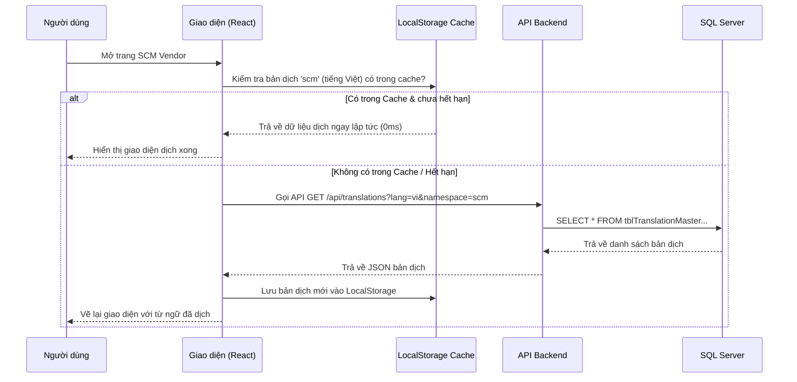

# Kế Hoạch Chi Tiết: Triển Khai, Cơ Chế Hoạt Động & Tối Ưu Hiệu Năng Hệ Thống i18n Động

Bản kế hoạch này phân tích sâu về **kiến trúc kỹ thuật**, **luồng hoạt động chi tiết** dưới nền (Under the Hood) và các phương án **tối ưu hiệu năng (Caching)** để đảm bảo hệ thống ERP chạy siêu nhanh, thực tế và dễ vận hành.

---

## 1. PHƯƠNG ÁN TRIỂN KHAI KỸ THUẬT (Technical Implementation)

Hệ thống sẽ được xây dựng dựa trên sự kết hợp chặt chẽ giữa Backend hiện tại (ASP.NET Core / SQL Server Gateway) và Frontend mới (React + i18next).

```text
+-------------------+      API Request      +------------------------+
|   React Frontend  | --------------------> | ASP.NET Core Backend   |
| (i18next Client)  | <-------------------- | (SQL Gateway API)      |
+-------------------+    JSON Translations  +------------------------+
         |                                               |
         | (Đọc/Ghi Cache)                               | (Truy vấn / Caching)
         v                                               v
+-------------------+                               +------------------------+
| LocalStorage Cache|                               | SQL Server Database    |
+-------------------+                               | (tblTranslationMaster) |
                                                    +------------------------+
```

### A. Phía Backend (SQL Server & API)
Chúng ta sẽ sử dụng chính cơ chế SQL Gateway hiện có của bạn để thiết lập:
1.  **API Get Translations**:
    *   *Endpoint*: `POST /SqlGateway/query` với body `{ queryName: "GetTranslations", parameters: { Lang: "vi", Namespace: "scm" } }` (hoặc viết một API Route riêng để tối ưu URL `GET /api/translations?lang=vi&namespace=scm`).
    *   *Câu lệnh SQL*:
        ```sql
        SELECT TranslationKey AS [key], TranslationValue AS [value] 
        FROM tblTranslationMaster 
        WHERE LanguageCode = @Lang AND Namespace = @Namespace AND ActiveFlag = 1
        ```
2.  **API Save Missing Key (Tự động ghi nhận key thiếu)**:
    *   *Endpoint*: `POST /api/translations/missing`
    *   *Câu lệnh SQL*:
        ```sql
        -- Kiểm tra nếu key chưa tồn tại thì chèn mới với giá trị trống
        IF NOT EXISTS (SELECT 1 FROM tblTranslationMaster WHERE TranslationKey = @Key AND Namespace = @Namespace)
        BEGIN
            INSERT INTO tblTranslationMaster (Namespace, TranslationKey, LanguageCode, TranslationValue, ActiveFlag)
            VALUES (@Namespace, @Key, 'vi', '', 1),
                   (@Namespace, @Key, 'en', '', 1)
        END
        ```

### B. Phía Frontend (Cấu hình i18next)
Cài đặt thêm gói: `npm install i18next-http-backend i18next-localstorage-backend`
Cấu hình trong `src/core/i18n.ts`:
```typescript
import i18n from 'i18n';
import HttpBackend from 'i18next-http-backend';
import LocalStorageBackend from 'i18next-localstorage-backend'; // Cache ở trình duyệt

i18n
  .use(LocalStorageBackend) // Thử đọc từ Cache trình duyệt trước
  .use(HttpBackend)         // Nếu không có cache, gọi API lấy từ DB
  .init({
    fallbackLng: 'vi',
    ns: ['common', 'scm'],
    defaultNS: 'common',
    saveMissing: true, // Bật tính năng phát hiện key thiếu
    
    backend: {
      // 1. Cấu hình đường dẫn lấy bản dịch qua API
      loadPath: 'http://localhost:5000/api/translations?lang={{lng}}&namespace={{ns}}',
      
      // 2. Cấu hình đường dẫn tự động gửi key thiếu lên Backend
      addPath: 'http://localhost:5000/api/translations/missing',
    },
    
    // Cấu hình Cache LocalStorage
    cache: {
      enabled: true,
      prefix: 'i18n_',
      expirationTime: 24 * 60 * 60 * 1000, // Cache trong 24 giờ
    }
  });
```

---

## 2. CƠ CHẾ HOẠT ĐỘNG CHI TIẾT (Under The Hood)

### Luồng 1: Tải Bản Dịch Khi Mở Màn Hình (Lazy-loading & Caching)


### Luồng 2: Tự Động Đăng Ký Key Mới (Auto-detect Missing Keys)
Khi lập trình viên viết thêm một key mới trong code: `t('scm:vendor.taxID')`
1.  `i18next` tra cứu trong bộ nhớ cache không thấy key `vendor.taxID`.
2.  Giao diện tạm thời hiển thị chính chữ `"vendor.taxID"` (không làm lỗi app).
3.  Sau 5 giây (cơ chế Debounce để gom nhiều key cùng lúc), `i18next` tự động gửi request `POST /api/translations/missing` lên Backend.
4.  Backend chèn dòng trống vào Database.
5.  Admin mở màn hình dịch thuật lên sẽ thấy key `vendor.taxID` đang chờ điền nghĩa.

---

## 3. TÍNH THỰC TẾ & HIỆU QUẢ CỦA GIẢI PHÁP

### A. Hiệu năng hệ thống (Performance)
*   **Không làm chậm ứng dụng**: Nhờ cơ chế **Caching ở trình duyệt (LocalStorage)**, API lấy bản dịch chỉ gọi duy nhất 1 lần đầu tiên khi user đăng nhập. Ở các lần click chuyển tab hay mở lại trang sau đó, thời gian tải bản dịch là **0ms** vì đọc trực tiếp từ RAM/LocalStorage.
*   **Không quá tải Database**: Phía Backend có thể cấu hình **In-Memory Cache (RAM)** cho API Dịch thuật. Khi Database có thay đổi (Admin bấm Lưu bản dịch), Backend chỉ cần xóa cache RAM này. Toàn bộ các request sau đó của hàng ngàn User đều được phục vụ trực tiếp từ RAM của Backend, không chạm vào SQL Server.

### B. Tính thực tế cho vận hành doanh nghiệp (Practicality)
*   **Chuyên nghiệp hóa khâu dịch thuật**: Key Users (Trưởng phòng mua hàng, trưởng phòng tài chính) có thể tự vào sửa thuật ngữ chuyên ngành trên màn hình Admin sao cho sát với thực tế doanh nghiệp của họ nhất, mà không cần phụ thuộc vào IT hay phải cài đặt/deploy lại phần mềm.
*   **Rút ngắn 80% thời gian code của Dev**: Dev không cần viết các file JSON dịch nữa. Dev chỉ cần nghĩ ra key ý nghĩa trong code React và viết, hệ thống tự động đăng ký key vào Database.

---

## Cập Nhật Lộ Trình Triển Khai Thực Hành

*   **Tuần 1 (Core & Auth)**: Setup Vite, React Router, viết httpClient.ts (xử lý Token).
*   **Tuần 2 (i18n & API)**: Tạo bảng database `tblTranslationMaster`, viết API Gateway và cấu hình `i18next` có cache + tự động bắt key thiếu.
*   **Tuần 3 (Layout & Admin)**: Thiết kế Layout ERP và xây dựng trang Admin quản lý bản dịch (Inline Edit bảng).
*   **Tuần 4 (ERP View)**: Triển khai hoàn chỉnh màn hình Vendor Master đa ngôn ngữ động.

---

## User Review Required

> [!IMPORTANT]
> **Xác nhận triển khai**:
> Giải pháp này kết hợp giữa tính năng tự động của thư viện và tối ưu caching là phương án tối ưu nhất cho các hệ thống ERP hiện đại.
> Bạn đã sẵn sàng để chúng ta bắt đầu **Bước 1: Khởi tạo dự án song song `frontend_boost`** chưa?
