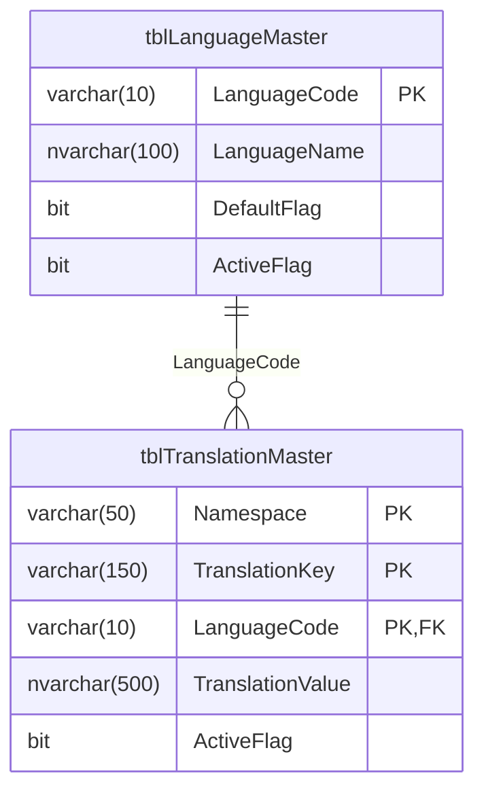

# Thiết Kế Chi Tiết Hệ Thống i18n Động (Database, Backend & Frontend)

Bản kế hoạch này cung cấp mã nguồn SQL tạo bảng, cấu trúc dữ liệu truyền nhận, code C# Backend (Dapper) và code cấu hình Frontend React chi tiết để bạn nắm rõ cách hoạt động của toàn bộ hệ thống.

---

## 1. THIẾT KẾ DATABASE (SQL Server)

Chúng ta cần tạo 2 bảng: bảng quản lý các ngôn ngữ (để hiển thị lên dropdown chọn ngôn ngữ) và bảng lưu trữ các từ dịch.



### Câu lệnh SQL tạo bảng (DDL):
```sql
-- 1. Bảng danh mục Ngôn ngữ
CREATE TABLE tblLanguageMaster (
    LanguageCode VARCHAR(10) PRIMARY KEY,      -- 'vi', 'en', 'ja'
    LanguageName NVARCHAR(100) NOT NULL,       -- N'Tiếng Việt', N'English'
    DefaultFlag BIT DEFAULT 0,                 -- 1 là ngôn ngữ mặc định
    ActiveFlag BIT DEFAULT 1                   -- 1 là đang hoạt động
);

-- 2. Bảng lưu trữ Bản dịch chi tiết
CREATE TABLE tblTranslationMaster (
    [Namespace] VARCHAR(50) NOT NULL,          -- 'common', 'scm', 'finance'
    TranslationKey VARCHAR(150) NOT NULL,      -- 'vendor.title', 'actions.save'
    LanguageCode VARCHAR(10) NOT NULL,         -- Liên kết tới tblLanguageMaster
    TranslationValue NVARCHAR(500) NULL,       -- Giá trị dịch
    ActiveFlag BIT DEFAULT 1,
    PRIMARY KEY ([Namespace], TranslationKey, LanguageCode),
    FOREIGN KEY (LanguageCode) REFERENCES tblLanguageMaster(LanguageCode)
);

-- Chèn dữ liệu mẫu ban đầu
INSERT INTO tblLanguageMaster (LanguageCode, LanguageName, DefaultFlag, ActiveFlag) VALUES 
('vi', N'Tiếng Việt', 1, 1),
('en', N'English', 0, 1);

INSERT INTO tblTranslationMaster ([Namespace], TranslationKey, LanguageCode, TranslationValue, ActiveFlag) VALUES 
('scm', 'vendor.title', 'vi', N'Quản lý nhà cung cấp', 1),
('scm', 'vendor.title', 'en', 'Vendor Management', 1),
('common', 'actions.save', 'vi', N'Lưu lại', 1),
('common', 'actions.save', 'en', 'Save', 1);
```

---

## 2. CƠ CHẾ HOẠT ĐỘNG PHÍA BACKEND (2 giải pháp lựa chọn)

### Giải pháp A: Sử Dụng SQL Gateway Có Sẵn (Không cần sửa code C# Backend)
Bạn chỉ cần thêm các câu lệnh SQL vào file JSON query của Backend (ví dụ `MasterDataQueries.json`):

```json
{
  "GetActiveLanguages": "SELECT LanguageCode, LanguageName, DefaultFlag FROM tblLanguageMaster WHERE ActiveFlag = 1",
  
  "GetTranslations": "SELECT TranslationKey AS [key], TranslationValue AS [value] FROM tblTranslationMaster WHERE LanguageCode = @Lang AND [Namespace] = @Namespace AND ActiveFlag = 1",
  
  "CreateMissingTranslation": "IF NOT EXISTS (SELECT 1 FROM tblTranslationMaster WHERE [Namespace] = @Namespace AND TranslationKey = @Key) BEGIN INSERT INTO tblTranslationMaster ([Namespace], TranslationKey, LanguageCode, TranslationValue, ActiveFlag) SELECT @Namespace, @Key, LanguageCode, '', 1 FROM tblLanguageMaster END",
  
  "UpdateTranslation": "UPDATE tblTranslationMaster SET TranslationValue = @Value WHERE [Namespace] = @Namespace AND TranslationKey = @Key AND LanguageCode = @Lang"
}
```
*   **Cách hoạt động**: Frontend sẽ gọi API `/SqlGateway/query` với tham số `queryName: "GetTranslations"` và body chứa tham số `@Lang`, `@Namespace`.

---

### Giải pháp B: Viết Một Controller C# Riêng Biệt (Tối ưu nhất cho i18next)
Tạo file `TranslationController.cs` trong project ASP.NET Core của bạn:

```csharp
using Microsoft.AspNetCore.Mvc;
using Dapper;
using System.Data.SqlClient;

[ApiController]
[Route("api/translations")]
public class TranslationController : ControllerBase
{
    private readonly string _connectionString = "Your_SQL_Server_Connection_String";

    // 1. API lấy toàn bộ bản dịch của 1 ngôn ngữ & namespace
    // Định dạng URL: GET /api/translations?lang=vi&namespace=scm
    [HttpGet]
    public async Task<IActionResult> GetTranslations([FromQuery] string lang, [FromQuery] string @namespace)
    {
        using (var db = new SqlConnection(_connectionString))
        {
            var query = @"SELECT TranslationKey AS [Key], TranslationValue AS [Value] 
                          FROM tblTranslationMaster 
                          WHERE LanguageCode = @Lang AND [Namespace] = @Namespace AND ActiveFlag = 1";
            
            var result = await db.QueryAsync<dynamic>(query, new { Lang = lang, Namespace = @namespace });
            
            // Chuyển đổi dữ liệu List từ Database thành dạng Object Dictionary Key-Value
            var translationMap = result.ToDictionary(
                row => (string)row.Key, 
                row => (string)row.Value ?? ""
            );
            
            return Ok(translationMap); // Trả về JSON: { "vendor.title": "Quản lý nhà cung cấp" }
        }
    }

    // 2. API tự động ghi nhận Key còn thiếu
    // Định dạng URL: POST /api/translations/missing
    [HttpPost("missing")]
    public async Task<IActionResult> SaveMissingKey([FromBody] MissingKeyRequest request)
    {
        using (var db = new SqlConnection(_connectionString))
        {
            var query = @"
                IF NOT EXISTS (SELECT 1 FROM tblTranslationMaster WHERE [Namespace] = @Namespace AND TranslationKey = @Key)
                BEGIN
                    -- Tự động nhân bản key này cho tất cả các ngôn ngữ đang hoạt động trong hệ thống
                    INSERT INTO tblTranslationMaster ([Namespace], TranslationKey, LanguageCode, TranslationValue, ActiveFlag)
                    SELECT @Namespace, @Key, LanguageCode, @Key, 1 
                    FROM tblLanguageMaster 
                    WHERE ActiveFlag = 1
                END";

            await db.ExecuteAsync(query, new { Namespace = request.Namespace, Key = request.Key });
            return Ok(new { Success = true });
        }
    }
}

public class MissingKeyRequest
{
    public string Namespace { get; set; }
    public string Key { get; set; }
}
```

---

## 3. CƠ CHẾ HOẠT ĐỘNG PHÍA FRONTEND (React)

Khi cấu hình i18next ở Frontend, nếu sử dụng **Giải pháp B** (Controller riêng), thư viện sẽ tự động hoạt động mượt mà. 

Nếu sử dụng **Giải pháp A** (SQL Gateway có sẵn), chúng ta sẽ viết một **Custom Backend Connector** cho i18next để chuyển đổi request đúng định dạng SQL Gateway:

```typescript
import i18n from 'i18next';
import { initReactI18next } from 'react-i18next';
import HttpBackend from 'i18next-http-backend';
import { apiFetch } from './core/api/httpClient'; // Hàm fetch của bạn

i18n
  .use(HttpBackend)
  .use(initReactI18next)
  .init({
    fallbackLng: 'vi',
    ns: ['common', 'scm'],
    defaultNS: 'common',
    saveMissing: true,
    
    backend: {
      // 1. Tự viết hàm Fetch dữ liệu dịch qua SQL Gateway
      request: async (options, url, payload, callback) => {
        try {
          if (url.endsWith('/missing')) {
            // Gửi key thiếu lên SQL Gateway
            await apiFetch('/SqlGateway/query', {
              method: 'POST',
              body: JSON.stringify({
                queryName: 'CreateMissingTranslation',
                parameters: { Namespace: payload.namespace, Key: payload.key }
              })
            });
            callback(null, { status: 200, data: {} });
          } else {
            // Lấy bản dịch từ SQL Gateway
            const { lang, namespace } = parseUrlParams(url); // Hàm phụ cắt chuỗi URL lấy param
            const rawData = await apiFetch<any[]>('/SqlGateway/query', {
              method: 'POST',
              body: JSON.stringify({
                queryName: 'GetTranslations',
                parameters: { Lang: lang, Namespace: namespace }
              })
            });
            
            // Chuyển đổi mảng [{key: "...", value: "..."}] thành object { key: value }
            const translationMap = rawData.reduce((acc, item) => {
              acc[item.key] = item.value;
              return acc;
            }, {} as Record<string, string>);
            
            callback(null, { status: 200, data: translationMap });
          }
        } catch (err) {
          callback(err, { status: 500, data: {} });
        }
      },
      loadPath: 'http://localhost:5000/translations?lang={{lng}}&namespace={{ns}}',
      addPath: 'http://localhost:5000/translations/missing',
    }
  });

function parseUrlParams(url: string) {
  const urlObj = new URL(url);
  return {
    lang: urlObj.searchParams.get('lang') || 'vi',
    namespace: urlObj.searchParams.get('namespace') || 'common'
  };
}
```

---

## User Review Required

> [!IMPORTANT]
> **Lựa chọn giải pháp**:
> - **Giải pháp A (SQL Gateway)**: Nhanh nhất, tận dụng code C# hiện tại, chỉ viết câu lệnh SQL vào file JSON ở Backend là xong.
> - **Giải pháp B (Controller riêng)**: Chuẩn RESTful API, tối ưu URL hơn nhưng yêu cầu viết thêm code C#.
> 
> Bạn thích giải pháp nào hơn? Hãy chọn một giải pháp và phê duyệt bằng cách nhấn **Proceed** (Phê duyệt) để chúng ta khởi tạo thư mục dự án song song `frontend_boost` nhé!
